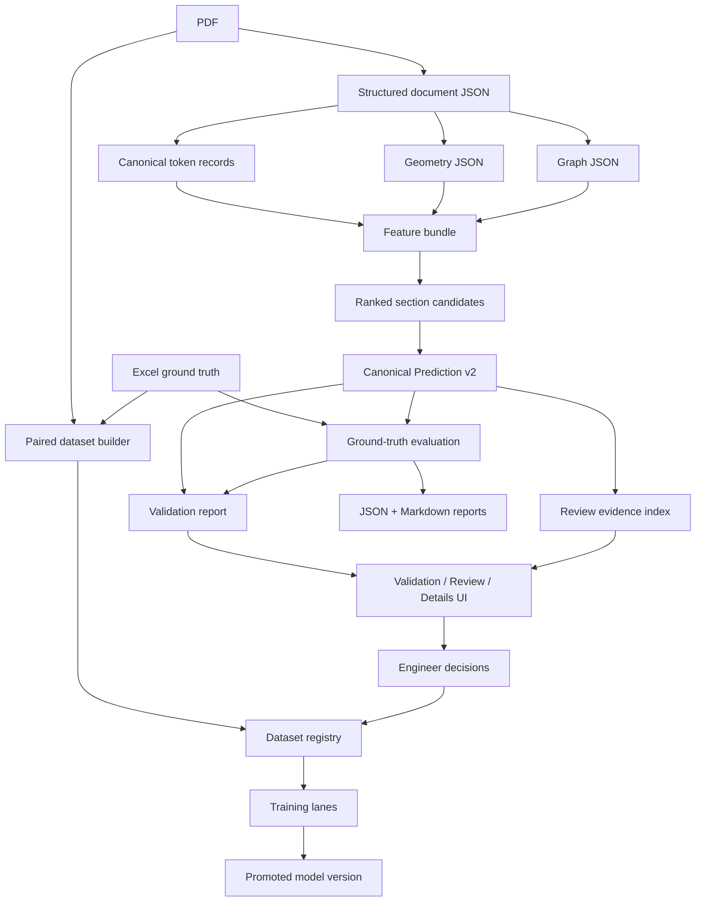
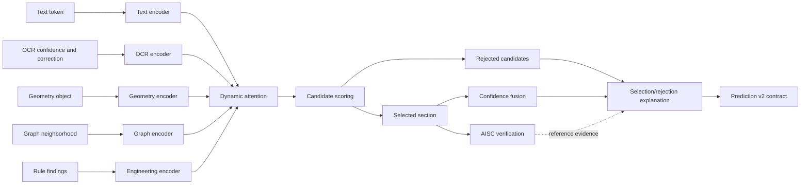

# Final Architecture

## System architecture

```mermaid
flowchart LR
    U[Engineer] --> FE[React / MUI frontend]
    FE --> UP[Upload-only document registry]
    UP --> API[Explicit extract / analyze stages]
    API --> EX[Cached document extraction]
    EX --> GEO[Geometry adapters]
    EX --> GRAPH[Structural graph]
    EX --> PRED[Prediction orchestrator]
    GEO --> PRED
    GRAPH --> PRED
    RULES[Engineering rules] --> PRED
    PRED --> FUSION[Attention fusion]
    FUSION --> EXP[Explainability v2]
    AISC[(AISC database)] -. verification only .-> EXP
    EXP --> VAL[Single multimodal validation]
    VAL --> REVIEW[Review queue]
    REVIEW --> DATA[Versioned datasets]
    GT[Excel ground truth] -. evaluation only .-> VAL
    GT -. paired dataset .-> DATA
    DATA --> TRAIN[Continuous learning]
    TRAIN --> MODELS[Versioned model registry]
    MODELS --> PRED
    VAL --> TAKEOFF[Reports and takeoff exports]
```

## Final runtime pipeline

1. The upload stage validates and persists PDF bytes, assigns a stable
   content-addressed document ID, and performs no extraction or inference.
2. The user starts extraction explicitly. The extraction layer produces
   filtered structural objects, tables, callouts, dimensions, layout,
   quality status, and diagnostics.
3. The user starts analysis explicitly. Geometry adapters and the structural
   graph enrich the cached document model without re-running extraction.
4. `prediction.orchestrator.predict_from_context` performs family inference,
   exact-section candidate generation, OCR correction candidates, modality
   encoding, attention fusion, and section selection.
5. The AISC database verifies the selected section after inference. It cannot
   select or override the prediction.
6. `explanation_engine` emits the canonical v2 explanation: prediction,
   confidence, ranked candidates, why selected, why rejected, matched
   neighbors, correction history, and text/OCR/geometry/graph/engineering
   evidence blocks.
7. The multimodal validation engine produces PASS/WARNING/FAIL and actionable
   corrections.
8. Low-confidence or conflicting predictions enter the Review Queue with the
   same explainability payload.
9. Approved reviews and PDF+Excel ground-truth pairs feed versioned datasets
   and controlled retraining.

## Data flow

## Multimodal prediction pipeline

## Canonical prediction contract

`services.prediction.contract.to_token_prediction` owns serialization. Required
v2 fields are:

- `family`, `section`, `confidence`
- `top_candidate_sections`
- `why_selected`, `why_rejected`
- `text_evidence`, `ocr_evidence`, `geometry_evidence`, `graph_evidence`,
  `engineering_evidence`
- `explanation` containing the same structured evidence
- `database_role = verification_only`

Legacy aliases remain additive: `prediction == section`,
`predicted_shape == section`, and `reasoning == explanation`.

## Ownership and non-duplication rules

- One production inference owner: `services/prediction/orchestrator.py`.
- One explanation builder: `services/prediction/explanation_engine.py`.
- One prediction serializer: `services/prediction/contract.py`.
- One full-document runtime: `services/multimodal/pipeline.py`.
- One multimodal validation owner:
  `services/multimodal/validation_engine.py`.
- One shared frontend renderer:
  `frontend/src/components/PredictionExplainability.jsx`.
- Excel parsers may normalize ground truth but cannot enter inference features.
- `multimodal/fusion_engine.py` is a compatibility adapter, not a second model.
