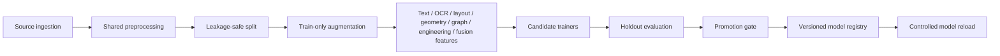

# Training and Continuous Learning

## Sources

1. Immutable AISC seed data supplies labels and engineering metadata.
2. Engineer-approved Review Queue decisions supply supervised corrections.
3. PDF+Excel pairs supply project ground truth; Excel never enters production
   inference.
4. Historical approved datasets remain provenance-tagged inputs.

## Pipeline

## Guarantees

- Preprocessing and feature extraction are shared by training lanes rather
  than reimplemented per trainer.
- Augmentation occurs only after the train/validation split.
- Dataset and model versions are immutable and carry schema versions.
- Promotion uses configured accuracy/F1 tolerances; a candidate is not
  promoted merely because training completed.
- Geometry, graph, and fusion lanes require configured minimum sample counts.
- Approved human corrections remain auditable and retain source provenance.

## Automatic PDF+Excel datasets

Analyzing a staged document with optional ground-truth Excel:

1. registers canonical source names in `training/pdf/` and `training/excel/`;
2. updates `pair_manifest.json`;
3. rebuilds paired dataset rows;
4. evaluates current PDF predictions against Excel;
5. emits JSON and Markdown evaluation reports.

## Operations

- Inspect status: `GET /api/continuous-learning/status`
- Trigger policy-controlled run: `POST /api/continuous-learning/trigger`
- List dataset versions: `GET /api/datasets/versions`
- List model versions: `GET /api/models/versions`
- Start asynchronous retraining: `POST /api/retrain/start`
- Monitor: `GET /api/retrain/status`

Promote and roll back models through the registry endpoints. Back up
`backend/training/` before production migrations.
