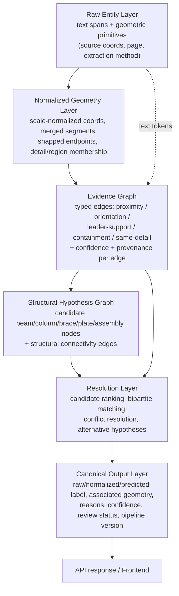

# 07 — Target Architecture

This proposes a layered structure for geometry/graph reasoning. It is a **target**, not a rewrite mandate — `08_prioritized_roadmap.md` sequences the smallest useful slices toward it. Nothing here should be read as "replace the pipeline"; today's `graph_builder.py`→`structural_graph.py` flow maps onto layers 2–3 below and can evolve into them incrementally.

## Layers

1. **Raw entity layer** — original text spans and geometric primitives exactly as extracted, with source coordinates and extraction provenance. Roughly today's `document["engineering_tokens"]` + `geometry["objects"]`, unchanged in spirit.
2. **Normalized geometry layer** — unit-normalized coordinates (once scale detection exists, `06_research_findings.md`), cleaned/merged segments, snapped endpoints, merged member-axis candidates, region/detail membership. **This layer does not exist today** — geometry flows raw into graph construction.
3. **Evidence graph** — text-to-geometry evidence: proximity, orientation, leader support, containment, same-detail context, each edge with confidence + provenance. Closest to today's `graph_builder.build_graph()` output, but with typed, provenance-carrying edges instead of the current mixed/duplicated relation names.
4. **Structural hypothesis graph** — candidate beams/columns/braces/plates/assemblies and their structural connectivity. Closest to today's `structural_graph.py` semantic layer, but separated from the evidence graph rather than overwriting it in place.
5. **Resolution layer** — constraints, candidate ranking, matching (bipartite/Hungarian), conflict resolution, explicit alternative hypotheses. Closest to today's `prediction/orchestrator.py` + `modular_fusion.py`, extended to consume structured graph evidence rather than only five scalar aggregates.
6. **Canonical output layer** — raw label, normalized label, predicted label, associated geometry, reasons, confidence, review status, pipeline version. This is essentially today's `canonical_contract.py` — the layer that is already closest to the target state.

## How data moves between layers



Each layer's output is a **superset-compatible, separately-serializable artifact** (mirroring today's `document.json`/`geometry.json`/`graph.json`/`predictions.json` pattern) — a new `normalized_geometry.json` and a split `evidence_graph.json` + `structural_graph.json` would replace today's single `geometry.json`/`graph.json`, keeping the existing artifact-store/caching mechanism (`staged_pipeline.py`, `artifact_store.py`) intact.

## Proposed schemas

These extend, rather than discard, today's dataclasses in `services/engineering/models.py`. Fields marked **NEW** don't exist today; fields marked **unchanged** map directly to current code.

### Geometry entity
```
GeometryEntity {
  entity_id: str                     # unchanged (today: geometry_id)
  kind: GeometryKind                 # unchanged, but split from semantic override (see structural hypothesis)
  as_drawn: {                        # NEW — preserves raw measurement, never overwritten
    bbox, points, length, area, orientation, page_number
  }
  normalized: {                      # NEW — layer 2 output
    bbox_real_units, length_real_units, orientation_deg,
    scale_factor_used, merged_from: [entity_id...]   # provenance for merged fragments
  }
  region_id: Optional[str]           # NEW — which detail/region this belongs to
  layer_name: Optional[str]          # unchanged field, but actually populated this time
  extraction_provenance: { page_number, drawing_index, extractor_version }  # NEW
}
```

### Text entity
```
TextEntity {
  entity_id: str                     # unchanged (today: token_id)
  raw_text: str                      # unchanged
  normalized_text: str               # unchanged — but sourced from ONE canonical normalizer, not 5-7
  bbox, page_number, font_size, rotation  # unchanged
  engineering_object_type: Optional[str]  # unchanged
}
```

### Drawing region (NEW — does not exist today)
```
DrawingRegion {
  region_id: str
  page_number: int
  bbox: [x0,y0,x1,y1]
  kind: "detail" | "schedule" | "title_block" | "grid_area" | "unknown"
  member_entity_ids: [str...]        # geometry/text entities inside this region
  confidence: float
}
```

### Graph node (evidence graph)
```
EvidenceNode {
  node_id: str                       # stable, derived from source_id — NOT random uuid4
  source_id: str                     # unchanged concept, now the join key everywhere
  entity_ref: {type: "text"|"geometry", entity_id: str}  # NEW — explicit back-reference, no dual-purpose "text" field
  base_kind: str                     # unchanged concept (renamed from today's overloaded "kind")
}
```

### Graph edge (evidence graph)
```
EvidenceEdge {
  edge_id: str                       # stable, derived from (source, target, relation) — not random
  source: node_id, target: node_id
  relation: EvidenceRelation         # NEW enum — one meaning per value, no "intersection"+"intersects" duplicates
  confidence: float                  # NEW — always populated, not sometimes-omitted
  distance: Optional[float]
  provenance: { rule: str, pass: "base"|"semantic", threshold_used: float }  # NEW — always populated
}
```

### Structural hypothesis (structural hypothesis graph — separate from evidence graph, not overwriting it)
```
StructuralHypothesis {
  hypothesis_id: str
  candidate_role: "beam"|"column"|"brace"|"plate"|"connection"|"bolt"|"weld"
  supporting_evidence_edges: [edge_id...]   # NEW — explicit link back to evidence, not silently overwritten kind
  assembly_id: Optional[str]                # NEW — groups related hypotheses (moment connection, etc.)
  confidence: float
  alternative_to: Optional[str]             # NEW — sibling hypothesis_id if this is one of several competing readings
}
```

### Association candidate (resolution layer)
```
AssociationCandidate {
  text_entity_id: str
  geometry_entity_id: str
  evidence_edge_ids: [edge_id...]    # every piece of evidence that supports this pairing
  score: float                       # explicitly labeled: heuristic score, not probability, unless calibrated
  rank: int
  selected: bool
  rejection_reason: Optional[str]    # NEW — why_rejected, structured not just templated text
}
```

### Final resolved element (canonical output layer — closest to today's state)
```
ResolvedElement {
  object_id: str                     # unchanged
  source_text: {...}                 # unchanged (canonical_contract.SourceText)
  prediction: {...}                  # unchanged (final_label, ranking_score, final_confidence, confidence_is_calibrated)
  comparison: {...}                  # unchanged (MatchStatus)
  decision: {...}                    # unchanged, but decision.source should include used_catalog consistently (today's bug, see 04_graph_audit.md)
  associated_geometry: [geometry_entity_id...]   # NEW — explicit, not implicit via graph traversal that's never actually read
  candidates: [AssociationCandidate...]
  needs_review: bool, review_reason: Optional[str]
  pipeline_version: str              # NEW — every artifact should carry the pipeline/schema version that produced it
}
```

## Worked data-flow example (mirrors `04_graph_audit.md`'s worked example, target-state version)

```mermaid
sequenceDiagram
    participant Raw as Raw Entity Layer
    participant Norm as Normalized Geometry Layer
    participant Ev as Evidence Graph
    participant Struct as Structural Hypothesis Graph
    participant Res as Resolution Layer
    participant Out as Canonical Output

    Raw->>Norm: beam line + leader stroke + detail-box rect (raw pts)
    Note over Norm: scale factor applied; beam line kept as one merged<br/>entity even if drawn as 2 fragments; region_id assigned<br/>from detail-box containment
    Norm->>Ev: normalized entities -> nodes
    Note over Ev: edges: proximity(label,beam)=0.8 conf,<br/>proximity(label,leader)=0.85 conf,<br/>containment(detail_box, beam)=1.0 conf<br/>— ALL retained, not collapsed to one
    Ev->>Struct: beam-shaped text + geometry -> StructuralHypothesis(role=beam)
    Note over Struct: leader is NOT a competing candidate for<br/>"nearest structural member" — it's flagged<br/>as leader-support evidence instead
    Struct->>Res: candidates ranked: beam-line (score .91) > leader (score .40, demoted)
    Res->>Out: associated_geometry=[beam_line_id], candidates=[...both, ranked...],<br/>rejection_reason for leader="leader support, not target member"
```

The key behavioral change from today (`04_graph_audit.md`'s worked example): the leader no longer competes on raw centroid distance against the true target member for the single `nearest_geometry` edge — it is explicitly typed as "leader support" evidence, and the resolution layer can see *both* the beam-line candidate and the leader-support edge instead of only whichever a greedy nearest-neighbor search happened to pick first.

## Migration posture

This is additive, not a rewrite:
- Layer 1 already matches current code.
- Layer 2 (normalized geometry) is new — it can be inserted as a post-processing step after today's `geometry_extractor.py` without touching extraction itself.
- Layer 3 (evidence graph) is `graph_builder.py` with typed edges and stable IDs — an in-place refactor, not a new module.
- Layer 4 (structural hypothesis) is `structural_graph.py` **without the in-place `node["kind"]` overwrite** — hypotheses become their own linked records instead of mutating evidence nodes.
- Layer 5 (resolution) is `prediction/orchestrator.py` + `modular_fusion.py`, extended to consume `AssociationCandidate` structures instead of only the five scalar `graph_consistency`-style aggregates.
- Layer 6 is already close to today's `canonical_contract.py`.

See `08_prioritized_roadmap.md` for how to sequence this without a stop-the-world rewrite.
